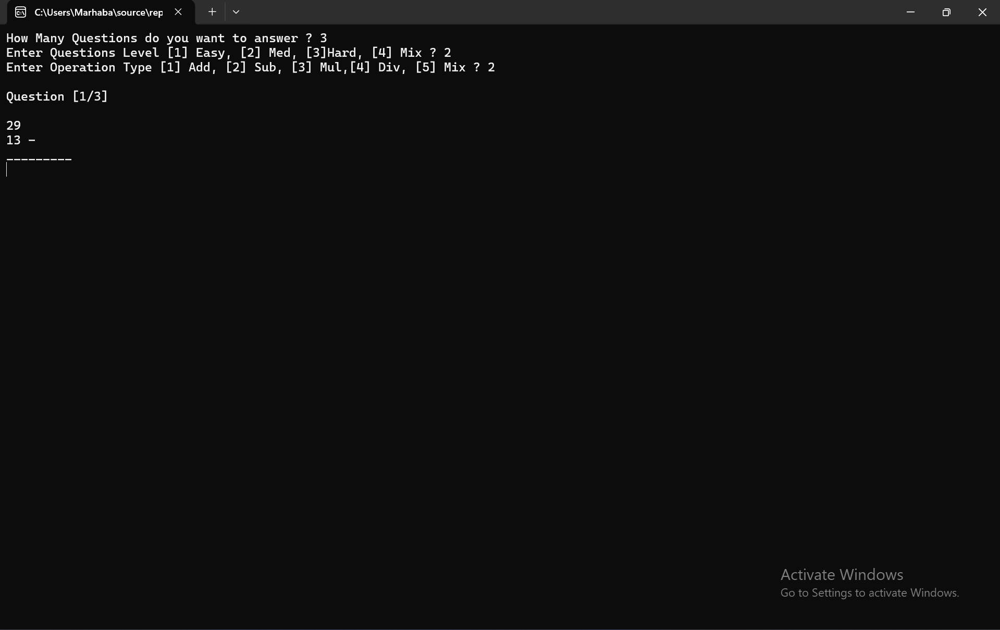
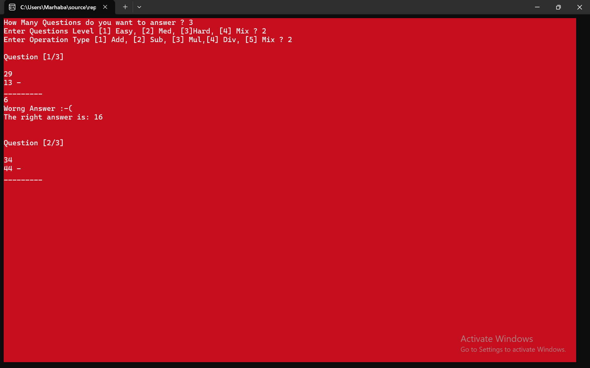
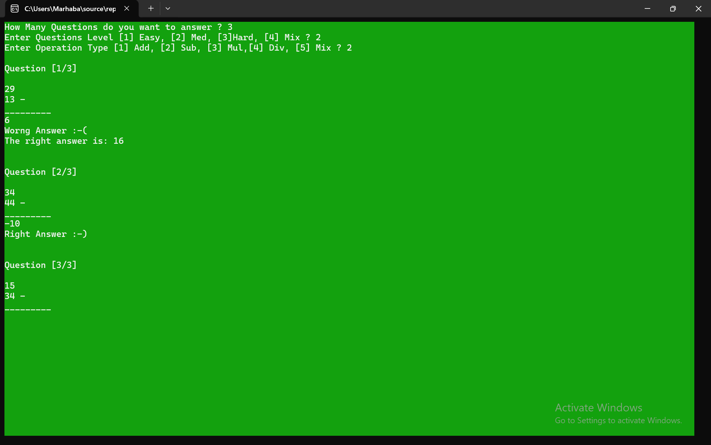
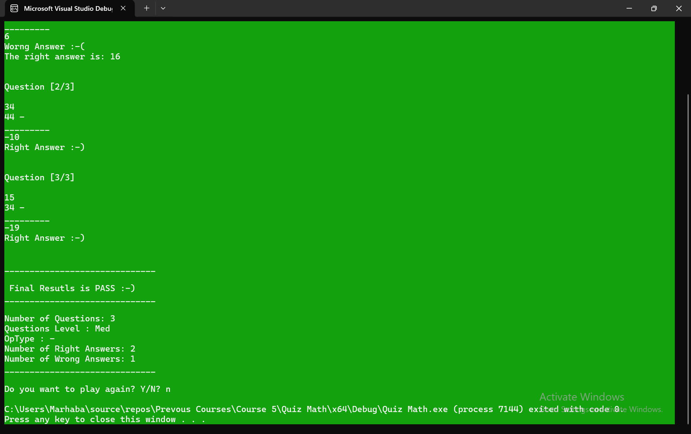

# Quiz Math Game

A simple console-based Math Quiz application developed in C++ using Object-Oriented Programming principles.

---

## 📌 Project Description

This project is a quiz game where the user answers math questions and receives a score based on correct answers. The program is designed to practice C++ fundamentals and OOP concepts.

---

## 🛠️ Technologies Used

- C++
- Object-Oriented Programming (OOP)
- Console Application

---

## 🎯 Features

- Random or predefined math questions
- Score tracking system
- User input validation
- Simple and interactive console interface
- Replay option (if implemented)

---

## 🧠 What I Learned

- Basic C++ programming structure
- Functions and control flow
- OOP principles (classes and objects)
- Input/output handling in console applications
- Problem-solving and logic building

---

## 📷 Preview

  
  

  
  

---

## 👨‍💻 Author

Hazem Ahmad Hazem  
- GitHub: https://github.com/HazemAhmadHaz
- LinkedIn: https://www.linkedin.com/in/hazem-ahmad-haz
- Email: HazemAhmad01234@gmail.com
